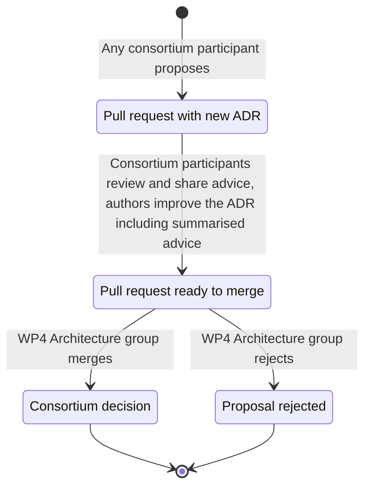

# Architecture decision records

[WE BUILD](https://www.webuildconsortium.eu/) maintains a lightweight architecture decision record (ADR) for each software-related decision affecting interoperability.

## ADR overview

<!--BEGIN INDEX-->
1. [You could be first 🚀](_template.md)
<!--END INDEX-->

## ADR process for WE BUILD

